# Tarea 01: Instalación de un CMS en un VPS

**Franco Naraza**

## Introducción

En esta práctica se realiza la instalación y configuración de un CMS WordPress en un servidor Ubuntu Server, utilizando una pila LAMP formada por Apache, MariaDB y PHP. La administración del servidor se realiza de forma remota mediante SSH.

## Instalación y configuración de WordPress

A continuación se muestran los pasos realizados durante la instalación y configuración del servidor y de WordPress.

1. Para comenzar la práctica se crea la máquina virtual que funcionará como servidor. En ella se instalará Ubuntu Server y posteriormente todos los servicios necesarios para ejecutar WordPress.

   

   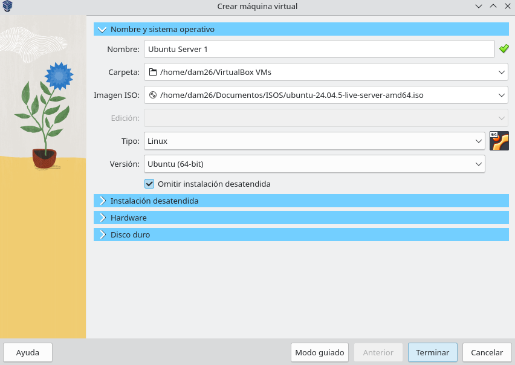
    
   <em>Creación de la máquina virtual.</em>
   

2. Durante la instalación de Ubuntu Server se configura el perfil del usuario que utilizaremos para administrar el servidor y realizar las diferentes tareas de la práctica.

   

   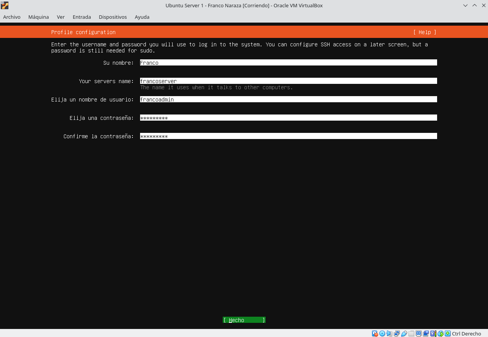
    
   <em>Configuración del usuario.</em>
   

3. Una vez terminada la instalación de Ubuntu Server, se comprueba que el servidor está preparado para ser administrado de forma remota desde el equipo anfitrión mediante SSH.

   

   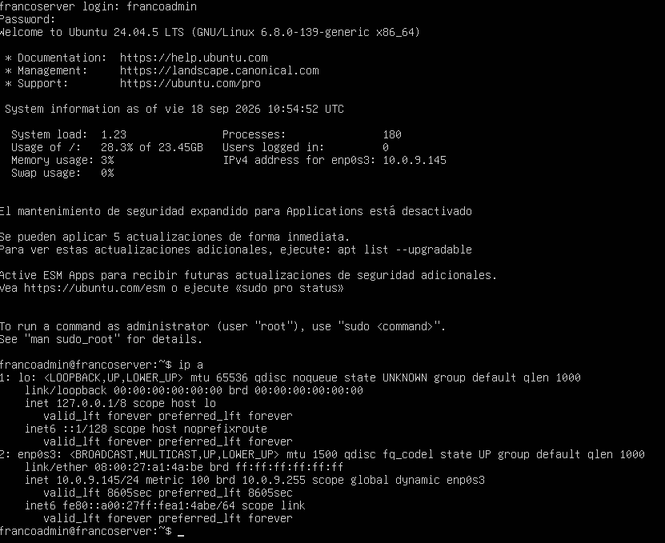
    
   <em>Servidor preparado para SSH.</em>
   

4. Desde el equipo anfitrión se establece una conexión SSH con la máquina virtual. A partir de este momento, la configuración del servidor se realiza de forma remota desde el ordenador anfitrión.

   

   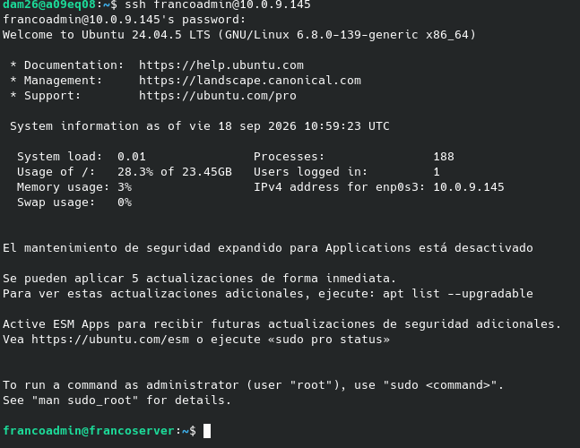
    
   <em>Conexión mediante SSH.</em>
   

5. Antes de instalar los servicios necesarios, se actualiza la información de los paquetes disponibles en Ubuntu para asegurarnos de trabajar con los repositorios actualizados.

   

   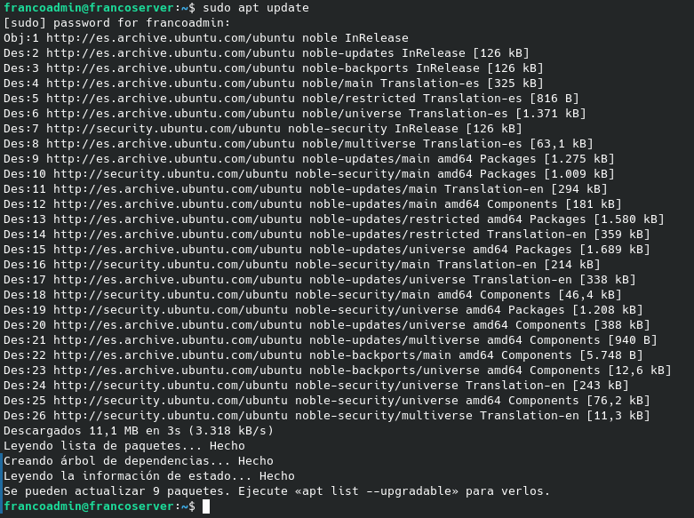
    
   <em>Ejecución de apt update.</em>
   

6. Se instalan los diferentes programas necesarios para montar la pila LAMP y ejecutar WordPress. Entre ellos se encuentran Apache como servidor web, MariaDB como sistema de bases de datos y PHP junto con sus módulos.

   

   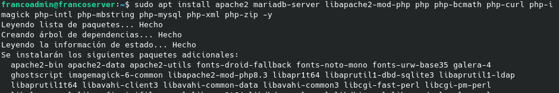
    
   <em>Instalación de Apache, MariaDB y PHP.</em>
   

7. Una vez finalizada la instalación, se comprueba que los programas necesarios se han instalado correctamente y que el sistema está preparado para continuar con la configuración.

   

   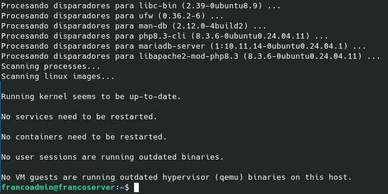
    
   <em>Programas instalados.</em>
   

8. Se consulta el estado del servicio Apache para comprobar que el servidor web se encuentra activo y funcionando correctamente.

   

   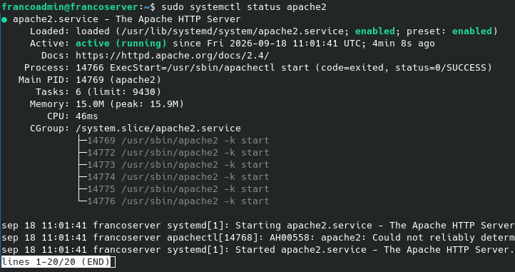
    
   <em>Apache activo.</em>
   

9. Se comprueba el estado del servicio MariaDB, que será utilizado posteriormente para almacenar la información de WordPress.

   

   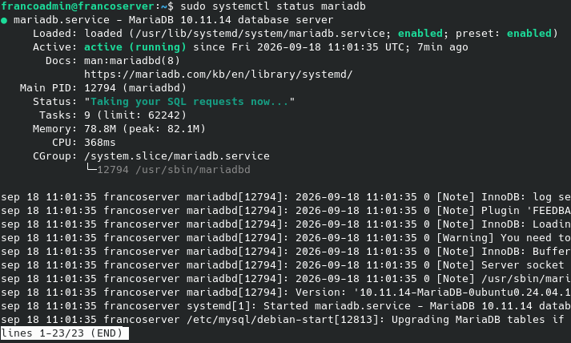
    
   <em>MariaDB activa.</em>
   

10. Se comprueba la versión de PHP instalada en el servidor para verificar que PHP está disponible y preparado para ejecutar WordPress.

   

   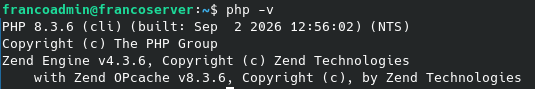
    
   <em>Versión de PHP.</em>
   

11. Se ejecuta la herramienta de configuración segura de MariaDB. En este proceso se eliminan configuraciones y usuarios innecesarios y se aplican diferentes medidas básicas de seguridad.

   

   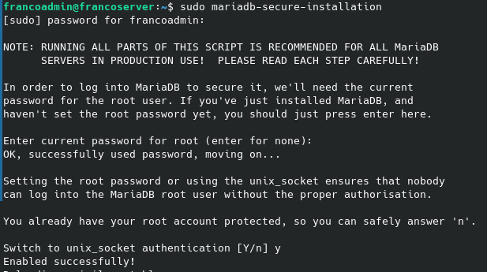
    
   <em>Configuración de seguridad de MariaDB.</em>
   

12. Se crea la base de datos que utilizará WordPress y también un usuario específico con permisos sobre ella. De esta forma, WordPress podrá almacenar y consultar su información en MariaDB.

   

   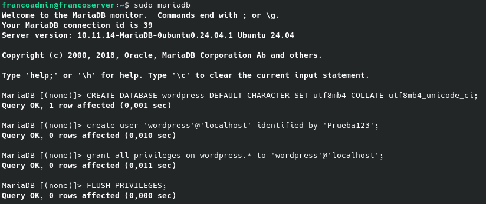
    
   <em>Creación de la base de datos.</em>
   

13. Después de crear la base de datos, se utiliza `SHOW DATABASES` para comprobar que la base de datos llamada `wordpress` se ha creado correctamente.

   

   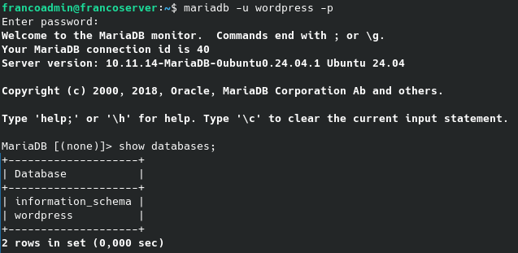
    
   <em>Comprobación de la base de datos.</em>
   

14. Se prepara la ubicación donde se almacenarán los archivos de WordPress y se descarga el paquete desde la página oficial. Los archivos quedan situados en `/srv/www/wordpress`.

   

   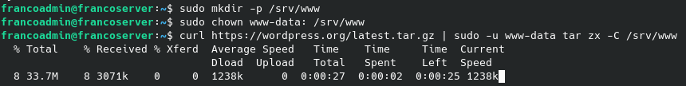
    
   <em>Descarga de WordPress.</em>
   

15. Se crea un archivo de configuración para Apache en el que se indica la ubicación de los archivos de WordPress y se permite que Apache pueda servir correctamente el sitio web.

   

   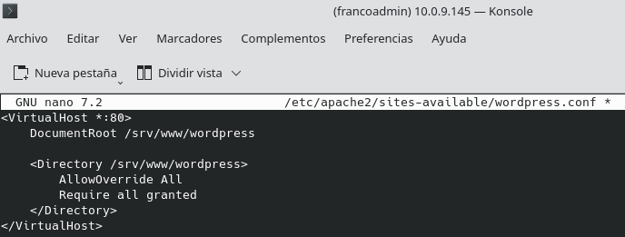
    
   <em>Configuración de Apache.</em>
   

16. Se activa la configuración creada para WordPress y los módulos necesarios de Apache. También se desactiva la configuración predeterminada para que Apache utilice la configuración de nuestro sitio.

   

   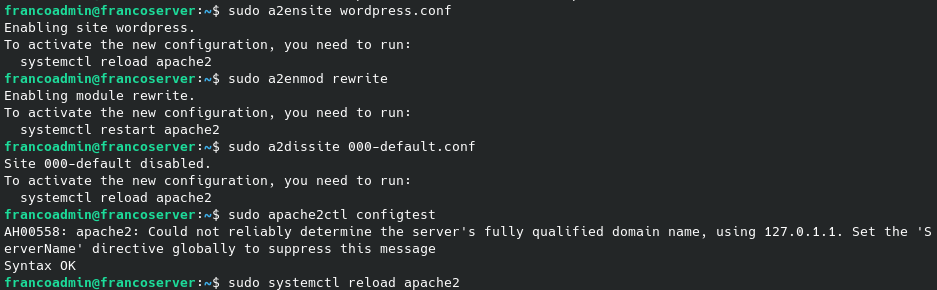
    
   <em>Activación de WordPress en Apache.</em>
   

17. Se prepara el archivo `wp-config.php`, que contiene los datos necesarios para que WordPress pueda conectarse con la base de datos MariaDB creada anteriormente.

   

   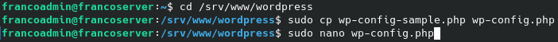
    
   <em>Configuración de wp-config.php.</em>
   

18. Dentro del archivo se introducen los datos de conexión correspondientes a la base de datos, el usuario y la contraseña creados anteriormente. Después se guarda la configuración.

   

   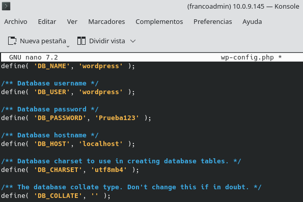
    
   <em>Datos de conexión configurados.</em>
   

19. Una vez configurado el servidor, se accede desde el navegador del equipo anfitrión utilizando la dirección IP de la máquina virtual. Esto permite comprobar que WordPress está disponible desde el navegador.

   

   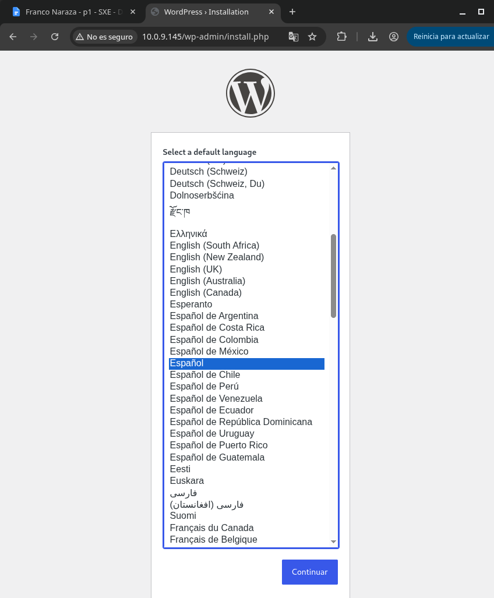
    
   <em>Acceso a WordPress.</em>
   

20. En el instalador web de WordPress se completan los datos iniciales del sitio, como el título, el usuario administrador y la contraseña que se utilizará para acceder al panel de administración.

   

   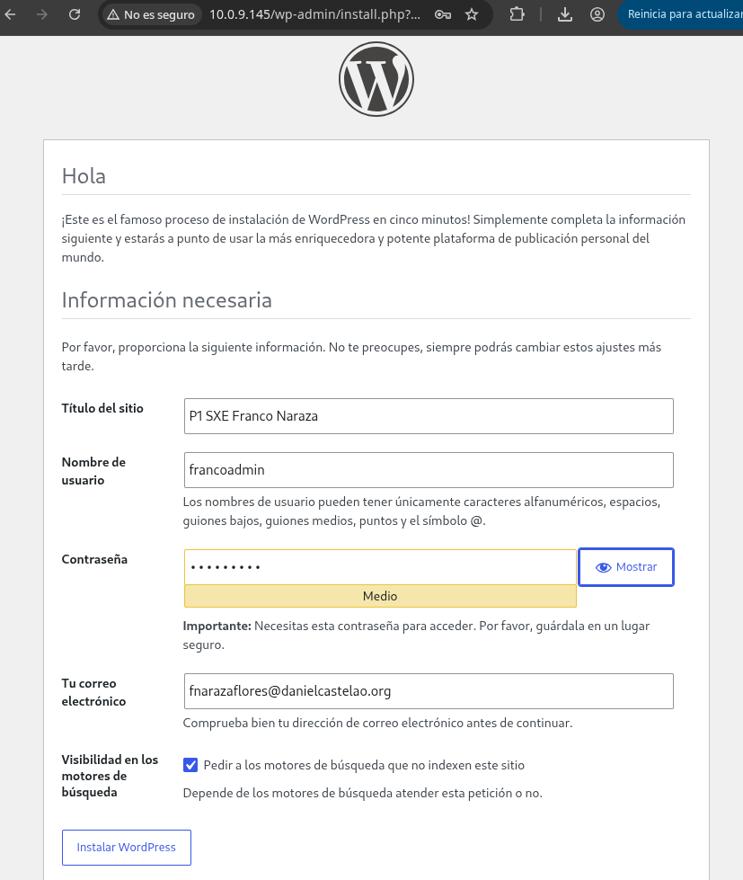
    
   <em>Configuración inicial de WordPress.</em>
   

21. Finalmente, WordPress muestra que la instalación se ha completado correctamente. A partir de este momento el sitio ya está instalado y listo para ser utilizado.

   

   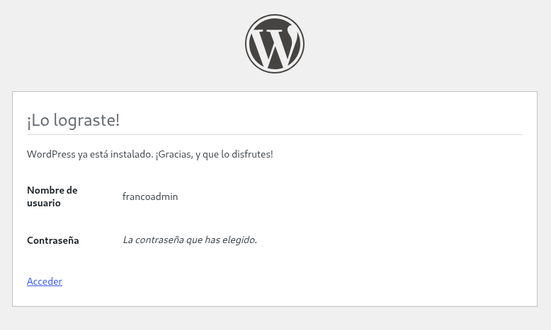
    
   <em>WordPress instalado correctamente.</em>
   

## Bibliografía

- [Ubuntu – Install and configure WordPress](https://ubuntu.com/tutorials/install-and-configure-wordpress)
- [Ubuntu – OpenSSH Server](https://ubuntu.com/server/docs/how-to/security/openssh-server/)
- [Apache HTTP Server – Virtual Hosts](https://httpd.apache.org/docs/2.4/vhosts/)
- [WordPress – Installation FAQ](https://wordpress.org/documentation/article/faq-installation/)
- [MariaDB – CREATE DATABASE](https://mariadb.com/docs/server/reference/sql-statements/data-definition/create/create-database)

### Prompt importante utilizado en Chatgpt

> He instalado Apache y WordPress en mi Ubuntu Server. WordPress está situado en `/srv/www/wordpress`, pero al introducir la IP del servidor en el navegador aparece la página predeterminada de Apache en lugar de WordPress. He creado `wordpress.conf` en `/etc/apache2/sites-available/`. Explícame qué puede estar ocurriendo y qué comandos debo ejecutar para activar la configuración de WordPress, desactivar `000-default.conf` y recargar Apache. También dime cómo comprobar que la configuración no tiene errores.